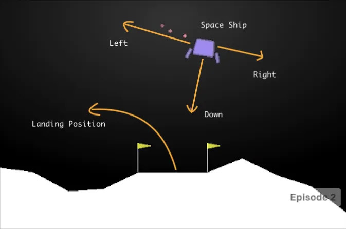

# LunarLander-v2 🚀 with Deep Neuroevolution 
Deep Neuroevolution algorithm for LunarLander-v2 in gym (gymnasium)

<div align="center">
  <a href="https://www.buymeacoffee.com/hdnh2006" target="_blank">
    
  </a>
</div>

<p align="center">
  
</p>


## Deep Neuroevolution 🧬
Deep Neuroevolution was first introduced by Uber AI Labs in 2018. They presented their [paper](https://arxiv.org/pdf/1712.06567.pdf) *"Deep Neuroevolution: Genetic Algorithms are a Competitive Alternative for Training Deep Neural Networks for Reinforcement Learning"*.

In this repository, we showcase an application of Deep Neuroevolution algorithms for training a neural network. Our approach eschews traditional gradient-based methods in favor of genetic algorithms, incorporating classical operations such as:
- Initialization.
- Selection.
- Reproduction.
- Crossover.
- Elitism.

## Lunar Lander Game 🚀
Lunar Lander is a single-player arcade game in the Lunar Lander subgenre. It was developed by Atari, Inc. and released in August 1979. It was the most popular version to date of the "Lunar Lander" concept, surpassing the prior Moonlander (1973) and numerous text-based games, and most later iterations of the concept are based on this Atari version. (Source: [link](https://en.wikipedia.org/wiki/Lunar_Lander_(1979_video_game))

We use [gymnasium](https://gymnasium.farama.org/environments/box2d/lunar_lander/) (formerly known as gym) to simulate the game, with the primary objective being to successfully land the spacecraft between two flags.
<div align="center">
  
</div>

## Usage 🔥

Python 3.8 or later with all [requirements.txt](requirements.txt) dependencies installed, including `torch>=1.7`. 

You will first need to install [`swig`](https://github.com/swig/swig) (Simplified Wrapper and Interface Generator). To install run:
```bash
sudo apt update
sudo apt install swig
```

Then just install the requirements:
```bash
pip install -r requirements.txt
python main.py
```


## TODO 👨‍💻
- [ ] Parallelize the executions of the agents.
- [ ] Calculations on Cuda.

## Acknowledgments  🙏
This repo is based on the following repositories and articles:
- https://github.com/paraschopra/deepneuroevolution
- https://github.com/shivaverma/OpenAIGym/tree/master/lunar-lander?source=post_page-----785675066197--------------------------------

## About me and contact 🌐
If you want to know more about me, please visit my blog: [henrynavarro.org](https://henrynavarro.org).


